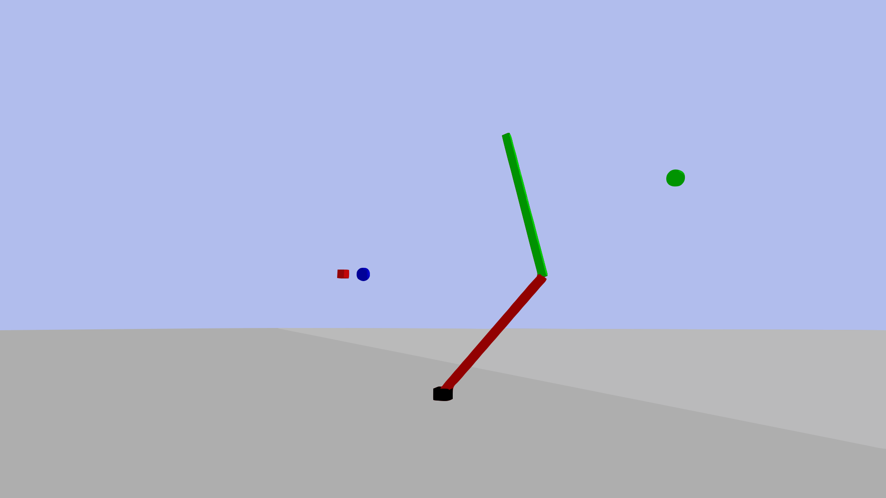

# Control System for Safe and Optimal Trajectory Execution in Robots

This repository contains the code and simulation framework developed for the thesis _"Control System for Safe and Optimal Trajectory Execution in Robots."_ The project proposes a novel learning-based controller that enables safe and efficient execution of robot trajectories under physical constraints using a combination of Proximal Policy Optimization (PPO) and Generative Adversarial Networks (GANs).

---

## Overview

This work presents a learning-based control framework for torque-driven robotic manipulators operating under physical constraints. The proposed system is trained using an innovative approach that combines Proximal Policy Optimization (PPO) and Generative Adversarial Networks (GANs). The learned policy is shaped to imitate reference trajectories generated by a Model Predictive Controller (MPC), ensuring safety and efficiency.

The architecture integrates complementary mechanisms to enforce physical constraints, such as torque and velocity limits, and is designed for robust generalization across multiple scenarios.

The system is evaluated on a planar 2-DoF robot with realistic actuation limits. Performance is assessed based on:

- Mean and standard deviation of position and velocity tracking errors
- Inference time and variability
- Constraint violation metrics

The results demonstrate that the proposed controller achieves inference times over **17× faster** than the MPC baseline, enabling real-time deployment with minimal computational resources. It offers a competitive and practical alternative to classical model-based approaches in scenarios requiring **fast**, **safe**, and **generalizable** control.

---

## Simulation Environment

*Simulation environment showing the 2-DoF planar robot in PyBullet.The green sphere represents the starting point, the blue sphere represents the goal point, and the red cube is an obstacle.*

---

## Repository Structure

| Folder/File        | Description |
|--------------------|-------------|
| `models/`          | Contains the URDF models used to simulate the 2-DoF robotic manipulator. |
| `mpc/`             | Codebase for generating reference trajectories using a constrained Model Predictive Controller. Includes all relevant simulation and optimization scripts. |
| `ppo/`             | Contains the training and evaluation scripts for the PPO-based controller. Includes model generation, policy evaluation, and reward shaping using GAN-based techniques. |
| `pybullet_ompl/`   | Includes geometric path planning code based on OMPL and PyBullet. This folder also bundles required planning libraries for sampling-based motion planning. |
| `utils/`           | Miscellaneous utilities such as data parsing, plotting tools, logging functions, and helper classes used throughout the project. |
| `ppt/`             | Contains presentation material or slide exports related to the thesis (optional for users). |
| `.gitattributes` / `.gitignore` | Git configuration files. |
| `README.md`        | This file. Project overview and usage documentation. |
